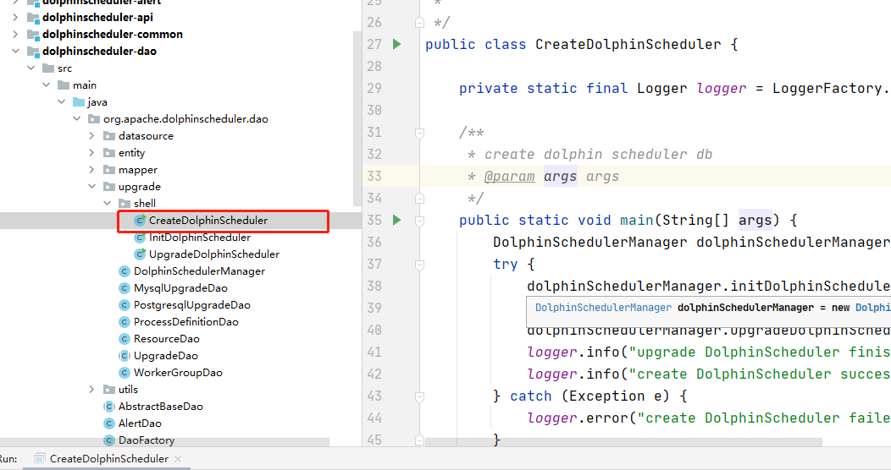

## 后端运行

1. 导入项目到idea,切换分支到master
2. 创建数据库dolphinscheduler
```shell script
CREATE DATABASE dolphinscheduler DEFAULT CHARACTER SET utf8 DEFAULT COLLATE utf8_general_ci;
CREATE USER 'dscheduler'@'%' IDENTIFIED BY 'dscheduler';
GRANT ALL PRIVILEGES ON dolphinscheduler.* TO 'dscheduler'@'%' IDENTIFIED BY 'dscheduler';
flush privileges;
```
3. 配置dolphinscheduler-dao模块中的数据库连接信息datasource.properties
```properties
# mysql
spring.datasource.driver-class-name=com.mysql.jdbc.Driver
spring.datasource.url=jdbc:mysql://localhost:3306/dolphinscheduler
spring.datasource.username=dscheduler
spring.datasource.password=dscheduler
```
4. 执行dolphinscheduler-dao模块下的CreateDolphinScheduler



5. windows下安装zookeeper(下载链接:http://archive.apache.org/dist/zookeeper/zookeeper-3.4.14/zookeeper-3.4.14.tar.gz)
6. 解压后在根目录下新建文件夹data和log
7. 将conf目录下的zoo_sample.cfg文件，复制一份，重命名为zoo.cfg,修改zoo.cfg配置文件，将dataDir=/tmp/zookeeper修改成zookeeper安装目录所在的data文件夹（需要在安装目录下面新建一个空的data文件夹和log文件夹），再添加一条添加数据日志的配置.
```properties
# the directory where the snapshot is stored.
# do not use /tmp for storage, /tmp here is just 
# example sakes.
#dataDir=/tmp/zookeeper

dataDir=E:\developer\env\zookeeper-3.4.14\data
dataLogDir=E:\developer\env\zookeeper-3.4.14\log
# the port at which the clients will connect
clientPort=2181
# the maximum number of client connections.
# increase this if you need to handle more clients
```
8. 启动zkServer.bat(详情链接:https://blog.csdn.net/qq_33316784/article/details/88563482)

## 前端运行

```shell script
# 进入项目目录
cd dolphinscheduler-ui

# 安装依赖
npm install

# 强烈建议不要用直接使用 cnpm 安装，会有各种诡异的 bug，可以通过重新指定 registry 来解决 npm 安装速度慢的问题。
npm install --registry=https://registry.npm.taobao.org

# 本地开发 启动项目
npm run start

# 默认账号/密码（admin/admin123）
```

## 参考链接
- https://blog.csdn.net/qq_33316784/article/details/88563482
- https://www.cnblogs.com/djlsunshine/p/13214539.html#!comments
